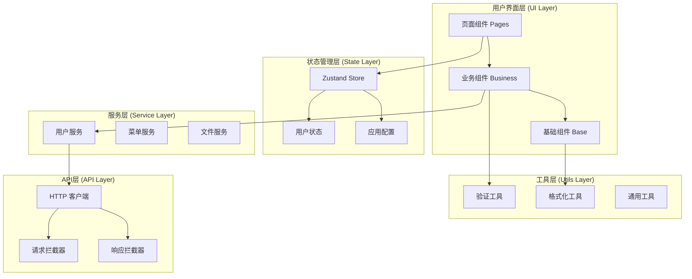
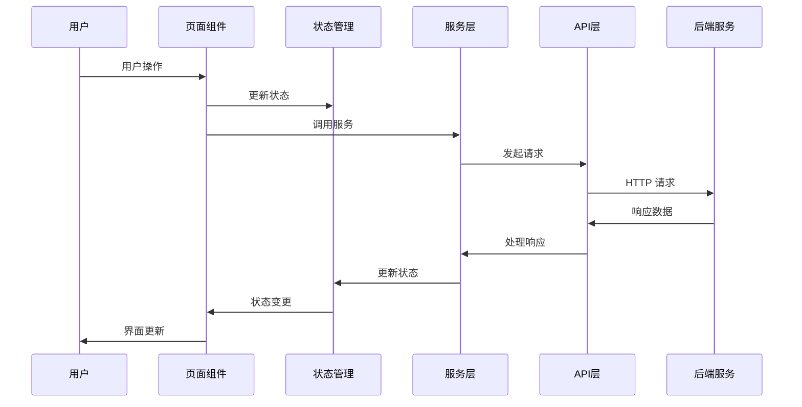
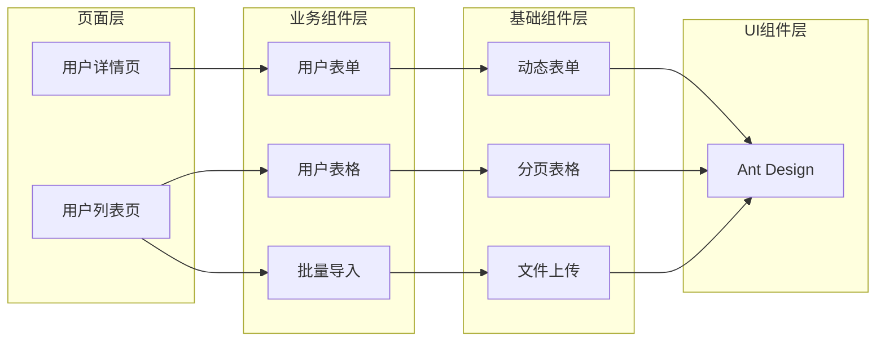
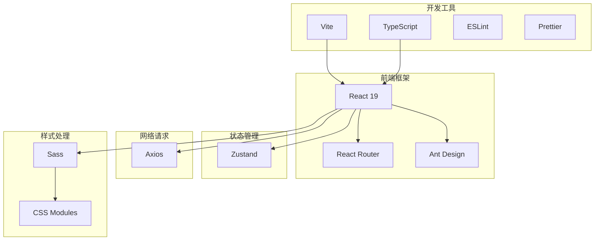
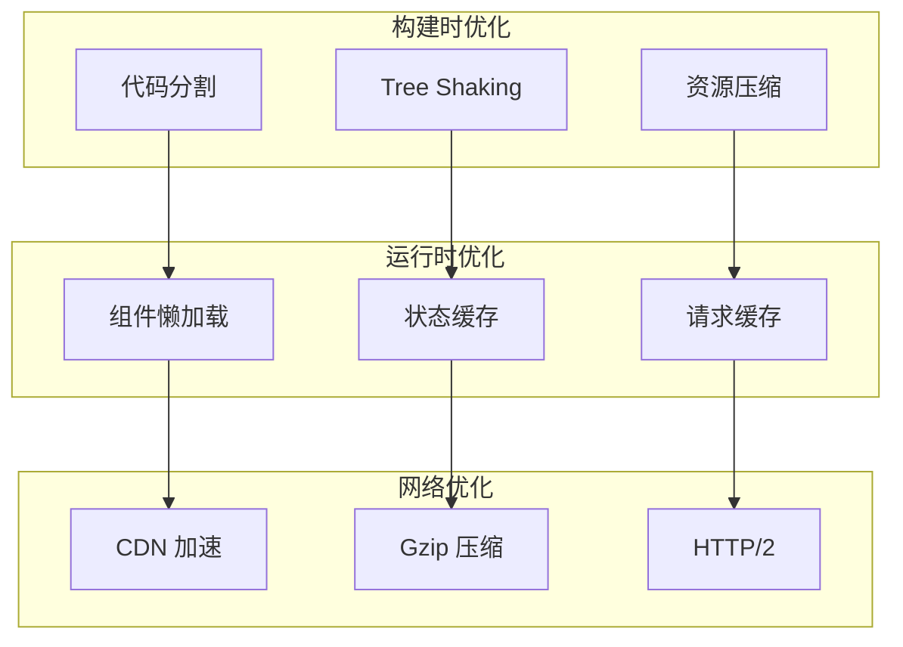

# 项目架构图详解

## 🏗️ 系统架构总览



## 📁 目录结构详细说明

```
vite-antd-pc/
├── .github/                    # GitHub 配置
│   └── workflows/              # CI/CD 工作流
├── .vscode/                    # VSCode 配置
│   ├── extensions.json         # 推荐扩展
│   ├── launch.json            # 调试配置
│   ├── settings.json          # 编辑器设置
│   └── tasks.json             # 任务配置
├── config/                     # 项目配置
│   └── proxy.ts               # 开发代理配置
├── public/                     # 静态资源
├── serve/                      # 生产服务器
├── src/                        # 源代码
│   ├── api/                   # API 接口层
│   │   ├── common.ts          # 通用接口
│   │   ├── config.ts          # 接口配置
│   │   └── index.ts           # 接口导出
│   ├── asset/                 # 静态资源
│   ├── component/             # 组件库
│   │   ├── business/          # 业务组件
│   │   │   ├── batch-import/  # 批量导入
│   │   │   ├── status-tag/    # 状态标签
│   │   │   └── confirm-modal/ # 确认对话框
│   │   ├── error-boundary/    # 错误边界
│   │   ├── form/              # 表单组件系统
│   │   │   ├── form.tsx       # 动态表单
│   │   │   ├── filter-form/   # 筛选表单
│   │   │   ├── modal-form/    # 弹窗表单
│   │   │   └── item/          # 表单项组件
│   │   │       ├── base/      # 基础表单项
│   │   │       └── custom/    # 自定义表单项
│   │   ├── icons/             # 图标组件
│   │   ├── layout/            # 布局组件
│   │   ├── loading/           # 加载组件
│   │   ├── page-content/      # 页面容器
│   │   ├── table/             # 表格组件
│   │   └── index.ts           # 组件导出
│   ├── constants/             # 常量定义
│   │   ├── common.ts          # 通用常量
│   │   ├── business.ts        # 业务常量
│   │   └── index.ts           # 常量导出
│   ├── hook/                  # 自定义 Hooks
│   │   ├── useTable.ts        # 表格 Hook
│   │   ├── useLocalStorage.ts # 本地存储 Hook
│   │   ├── useDebounce.ts     # 防抖 Hook
│   │   └── index.ts           # Hook 导出
│   ├── page/                  # 页面组件
│   │   ├── demo/              # 示例页面
│   │   │   ├── form/          # 表单示例
│   │   │   ├── layout/        # 布局示例
│   │   │   └── project/       # 项目示例
│   │   ├── home/              # 首页
│   │   ├── login/             # 登录页
│   │   ├── not-found/         # 404页面
│   │   └── system/            # 系统管理
│   ├── route/                 # 路由配置
│   │   ├── demo.tsx           # 示例路由
│   │   ├── system.tsx         # 系统路由
│   │   ├── index.tsx          # 路由入口
│   │   ├── type.d.ts          # 路由类型
│   │   └── util.tsx           # 路由工具
│   ├── service/               # 业务服务层
│   │   ├── user.ts            # 用户服务
│   │   └── index.ts           # 服务导出
│   ├── store/                 # 状态管理
│   │   ├── useBear.ts         # 示例状态
│   │   ├── useUserInfo.ts     # 用户信息状态
│   │   └── index.ts           # 状态导出
│   ├── style/                 # 样式文件
│   │   ├── custom.scss        # 自定义样式
│   │   └── theme.json         # 主题配置
│   ├── types/                 # 类型定义
│   │   └── form.ts            # 表单类型
│   ├── utils/                 # 新工具函数
│   │   ├── validation.ts      # 验证工具
│   │   └── format.ts          # 格式化工具
│   ├── util/                  # 工具函数(兼容)
│   │   ├── fetch.ts           # 请求工具
│   │   └── index.ts           # 工具导出
│   ├── App.tsx                # 应用入口
│   ├── App.scss               # 应用样式
│   ├── main.tsx               # 主入口
│   └── vite-env.d.ts          # Vite 类型
├── .dockerignore              # Docker 忽略文件
├── .editorconfig              # 编辑器配置
├── .env.example               # 环境变量示例
├── .gitattributes             # Git 属性
├── .gitignore                 # Git 忽略文件
├── .nvmrc                     # Node 版本
├── .prettierrc.json           # Prettier 配置
├── docker-compose.yml         # Docker 编排
├── Dockerfile                 # Docker 配置
├── Dockerfile.dev             # 开发环境 Docker
├── eslint.config.mjs          # ESLint 配置
├── index.html                 # HTML 模板
├── LICENSE                    # 许可证
├── nginx.conf                 # Nginx 配置
├── package.json               # 项目配置
├── README.md                  # 项目说明
├── TECHNICAL_SOLUTION.md      # 技术方案
├── tsconfig.json              # TypeScript 配置
└── vite.config.ts             # Vite 配置
```

## 🔄 数据流向图



## 🧩 组件依赖关系



## 📦 模块化设计

### 组件模块化
- **原子组件**: 最小粒度的UI组件
- **分子组件**: 由原子组件组合而成
- **有机体组件**: 复杂的业务功能组件
- **模板组件**: 页面级别的布局组件
- **页面组件**: 完整的业务页面

### 功能模块化
- **用户模块**: 用户管理相关功能
- **权限模块**: 权限控制相关功能
- **系统模块**: 系统设置相关功能
- **工具模块**: 通用工具函数

## 🔧 技术栈集成图



## 🚀 构建流程图


## 📊 性能优化策略图



这个架构图文档提供了项目的可视化结构说明，帮助团队成员更好地理解项目的整体架构和各模块之间的关系。
